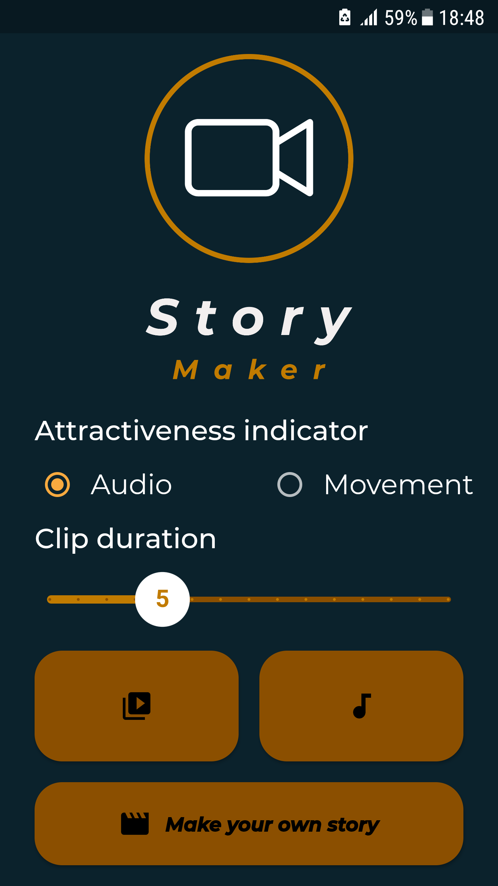
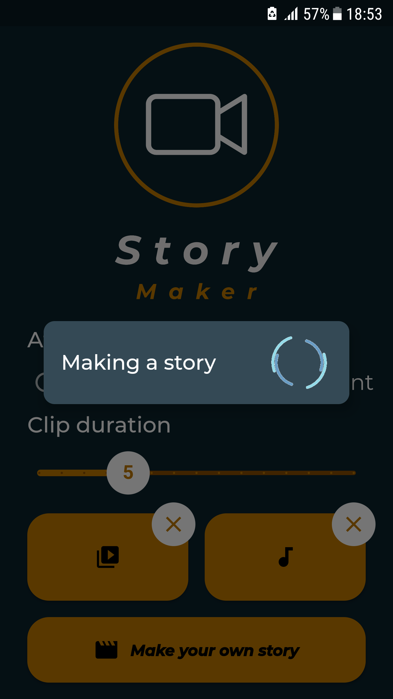
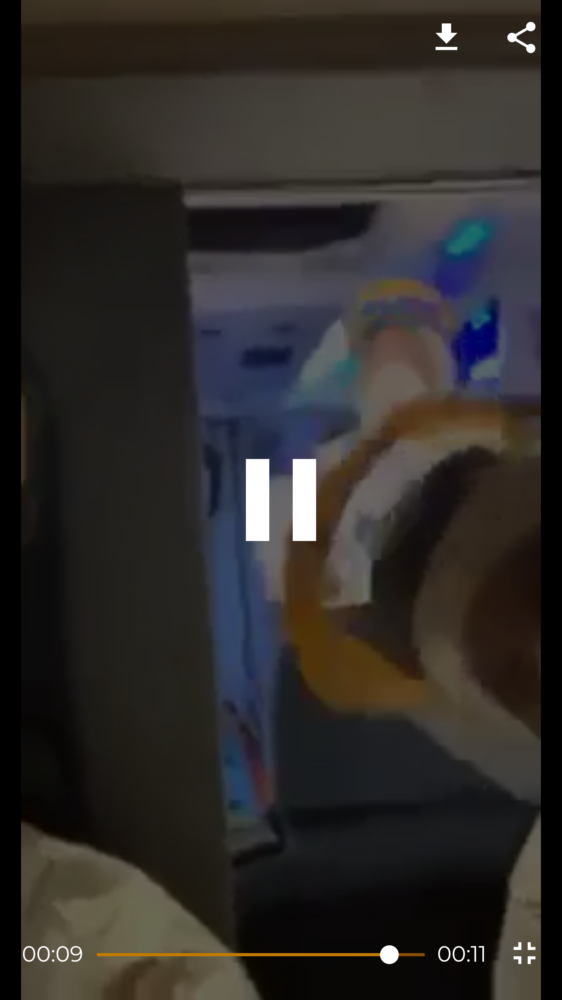

# Story Maker


The aim of the project is to create a mobile application that generates short movies (*stories*) based on video files selected by the user from the device memory. In addition, the application offers the option of selecting an audio file, a fragment of which is added as a soundtrack to the final clip being created. The main idea of the project was to implement an algorithm that automatically selects the most interesting moments from the indicated files and then joins them together.

## Getting Started

### Requirements

- [Flutter 1.17.4](https://docs.flutter.dev/development/tools/sdk/releases)
- [OpenJDK 11](https://www.oracle.com/java/technologies/downloads/#java11)

### Build and Run

```bash
# To build the .apk file
flutter build apk

# To run the mobile application
flutter run -d emulator-<emulator_id>
```

### Run Unit Tests

```bash
flutter test test
```

## Screenshots

|  |  |  |
| --- | --- | --- |
|  |  |  |

|  |
| --- |
|  |
